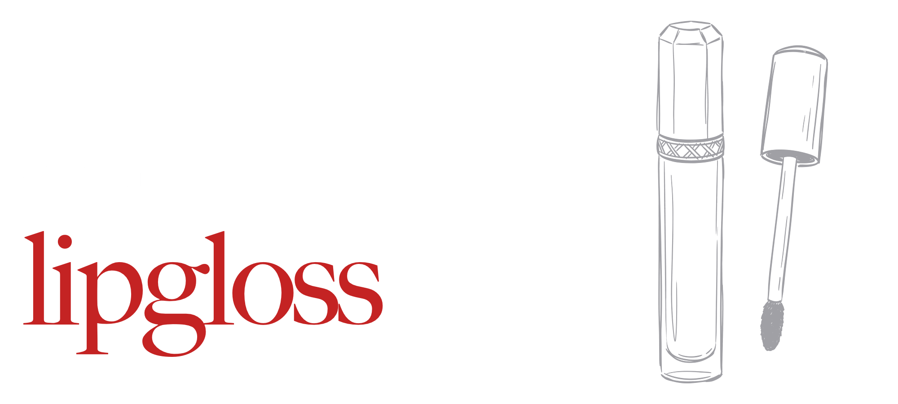

<p>
    <a href="charming-lipgloss.png"></a><br>
    <a href="https://crates.io/crates/charming-lipgloss"></a>
    <a href="https://github.com/coderbants/charming-lipgloss/actions"></a>
</p>

# Charming Lip Gloss (`charming-lipgloss`)

**Charming Lip Gloss** is a complete, from-scratch Rust port of [Lip Gloss](https://github.com/charmbracelet/lipgloss), the styling library that powers Charmbracelet's terminal apps. It tracks upstream Go releases on a rolling basis, with crate versions mirroring the upstream Go tags, and a hard goal of **1:1 behavioral and visual parity**: the same styles, rendering output, and layout semantics, favoring fidelity to upstream over Rust-native rewrites whenever the two would diverge.

It's part of the Charming port family of the Bubble Tea ecosystem and builds on [charming-ultraviolet](https://github.com/coderbants/charming-ultraviolet) (terminal renderer & input), [charming-x-ansi](https://github.com/coderbants/charming-x-ansi) (ANSI primitives), and [charming-colorprofile](https://github.com/coderbants/charming-colorprofile) — with UI components available in [charming-bubbles](https://github.com/coderbants/charming-bubbles) and the framework in [charming-bubbletea](https://github.com/coderbants/charming-bubbletea).

Style, format and layout tools for terminal applications. Built for Rust based on upstream [charmbracelet/lipgloss](https://github.com/charmbracelet/lipgloss).

<p>
    
</p>

## Overview

Charming Lip Gloss gives you a small, fast, dependency-free toolkit for styling and laying out terminal output:

- **Styles** — colors, bold/italic/underline, backgrounds, borders, margins, padding and alignment, all composed with a fluent builder API.
- **Text layout** — width and height control, word wrapping, truncation, and horizontal/vertical alignment.
- **Composition** — join strings horizontally or vertically, build tables, trees and lists, and render borders around any block.
- **Parity** — every upstream Go test is ported 1:1, and the E2E harness verifies byte-for-byte output against `charmbracelet/lipgloss`.


## Installation

```sh
cargo add charming-lipgloss
```

Use the crate to style, format and lay out terminal text:

```rust
use charming_lipgloss::new_style;
let styled = new_style().bold(true).foreground("63").render("hello");
```

`charming-lipgloss` provides styling, layout, string joining, border rendering, tables, trees, and lists for terminal UI applications in lightweight, zero-unsafe, minimal-dependency Rust.

## Principles

1. **Upstream Version Parity**: Crate versions mirror the upstream Go releases on a 1:1 basis.
2. **Borrowing Discipline**: Strongly prioritizes borrowing (`&str`, `&[T]`) over reference counting (`Arc`, `Rc`).
3. **Zero Unsafe**: Enforced `#![deny(unsafe_code)]`.
4. **100% Test Parity**: Complete 1:1 conversion of all upstream Go test cases to Rust `tests/*.rs`.

## Usage Example

Style text, then compose it into larger layouts:

```rust
use charming_lipgloss::{
    Border, Position, new_style, join_vertical, BOTTOM, CENTER, LEFT, RIGHT, TOP,
};

// A styled line of text.
let title = new_style()
    .bold(true)
    .foreground("#FF0000")
    .render("Hello Charming Lipgloss!");

// A block with a border, padded and aligned.
let panel = new_style()
    .border(Border::rounded())
    .width(30)
    .height(5)
    .align(&[CENTER])
    .render("Centered inside a rounded border");

// Join blocks together.
let layout = join_vertical(TOP, &[title, panel]);
println!("{layout}");
```

Styles compose: set a background on one style and inherit it into another with `inherit`, render bordered tables with `charming_lipgloss::table`, and lay out lists with `charming_lipgloss::list`. See the [examples](https://github.com/coderbants/charming-lipgloss/tree/dev/examples) directory for complete programs.

## License

[MIT](LICENSE)
